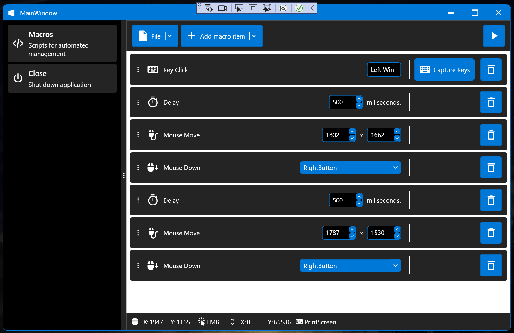
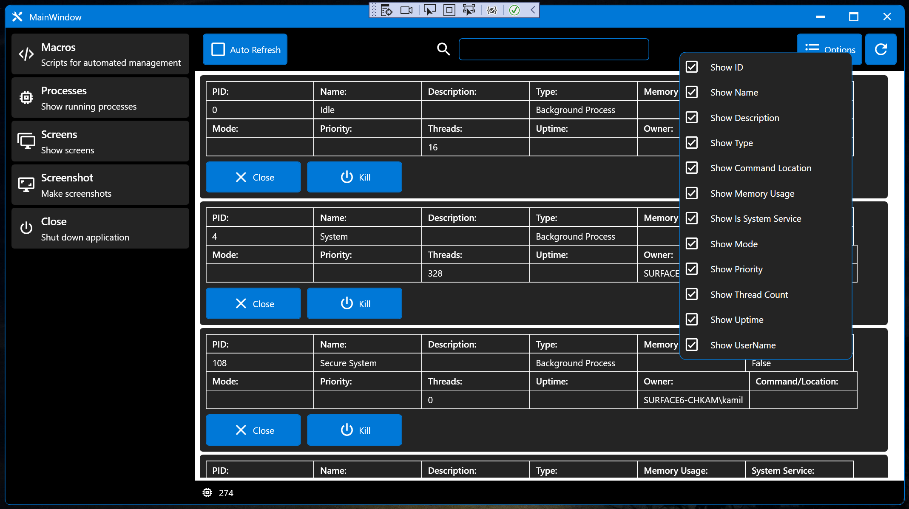
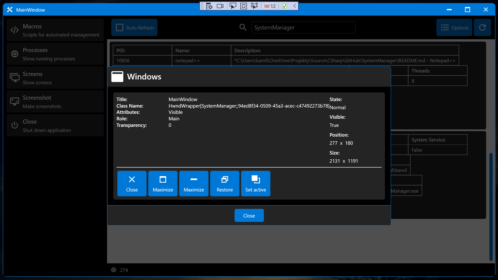
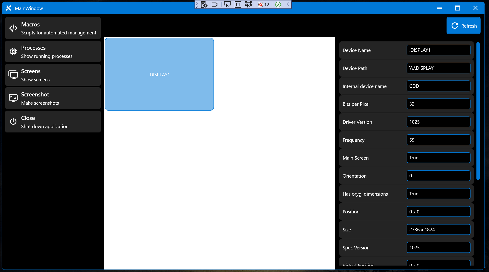
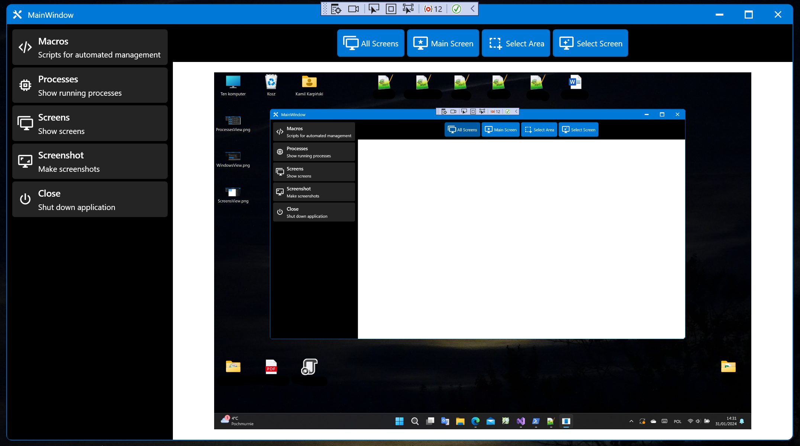

# SystemManager
Application and Library to interact with Windows Core.

## SystemController
Library for interaction with Windows Core.

- **MouseKeyboard**
  - [KeyboardReader](Docs/KeyboardReader.md)
  - [MouseKeyboardController](Docs/MouseKeyboardController.md)
  - [MouseReader](Docs/MouseReader.md)
- **Processes**
  - [ProcessManager](Docs/ProcessManager.md)
- **Screens**
  - [ScreenManager](Docs/ScreenManager.md)
  - [ScreenshotManager](Docs/ScreenshotManager.md)

## SystemManager

Macros View

Processes View

Windows View

Screens View

Screenshots View

